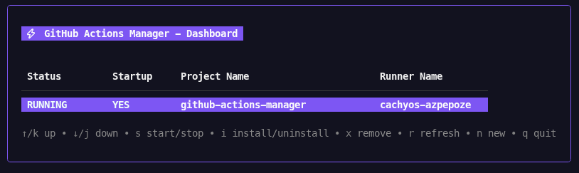
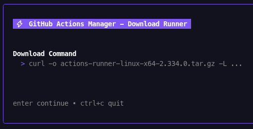
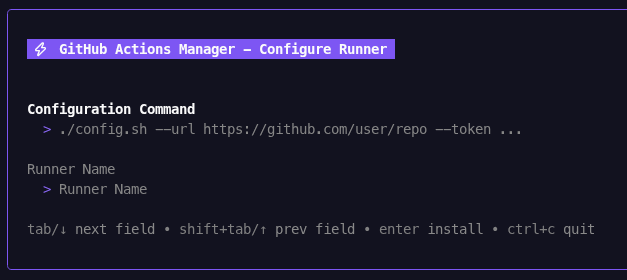

# GitHub Actions Manager

Terminal User Interface (TUI) for managing github actions runners on linux.

## Table of Contents

- [Quick Start](#quick-start)
- [Screenshots](#screenshots)
- [Prerequisites](#prerequisites)
- [Development](#development)

## Quick Start

To download the latest release and run it directly:

```bash
curl -L https://github.com/AzPepoze/github-actions-manager/releases/latest/download/github-actions-manager -o github-actions-manager
chmod +x github-actions-manager
./github-actions-manager
```

## Screenshots

### Dashboard


### Download Runner


### Config Runner


## Prerequisites

- Linux environment (required for runner services)
- Root/sudo access (for managing systemd services)

## Development

If you want to build from source:

### Prerequisites

- Go 1.21 or later
- golangci-lint (optional)

### Build Instructions

```bash
git clone https://github.com/AzPepoze/github-actions-manager.git
cd github-actions-manager
make build
./bin/github-actions-manager
```